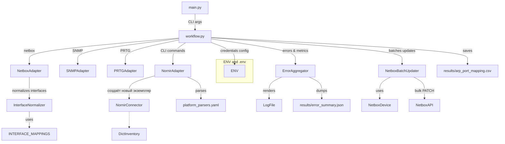

# ARP Port Mapper PRD

**Версия**: 1.1.0 build 20251001

## 1. Цели и задачи

Автоматизированное сопоставление ARP-записей gateway с портами коммутаторов, используя NetBox-инвентарь, SNMP-polling, CLI (Nornir) и PRTG, с поддержкой:
- нескольких шлюзов на одну площадку;
- динамического инвентаря;
- безопасного управления credentials;
- расширяемой архитектуры без жёстких YAML-конфигов;
- нормализации названий интерфейсов для точного сопоставления (например, `Po1` → `Port-channel1`);
- конфигурируемого обновления описаний в NetBox (с опцией не перезаписывать существующие описания);
- итоговой сводки ошибок и метрик для анализа результатов работы;
- CLI-интерфейса для гибкой настройки запуска (например, выбор площадок, пути к файлу результатов);
- автоматической организации результатов в папке `results/` (с возможностью переопределения через CLI).

Скрипт предназначен для mid-level sysadmins, управляющих сетевой инфраструктурой. Он позволяет быстро сопоставлять IP/MAC с портами, обновлять NetBox и анализировать ошибки без ручной работы. Пример: запуск для анализа подсетей с ролями "servers" и "workstations" на конкретных площадках, с сохранением результатов в кастомный файл.

Автоматическая актуализация SNMP-настроек (community и version) в NetBox для устройств, полученных из PRTG, при успешной проверке доступности по SNMP (используя OID для hostname). Это происходит в шаге `_get_snmp_settings_from_prtg` и контролируется флагом `enable_snmp_check_for_switches` в конфиге (по умолчанию False для производительности). Обновление использует hostname из SNMP для поиска устройства в NetBox и актуализирует custom fields только при необходимости.

## 2. Основные архитектурные требования

### 2.1 Структура входных данных

**CSV-шлюзы (`gw_list_file` из `config.py`)**
- Формат: `site;gw;prefix;community`
- Одна площадка может иметь произвольное число строк (шлюзов), каждый с отдельным IP и списком подсетей через запятую.
- На этапе парсинга пропускать строки без обязательных колонок/site/gw/prefix.
- В итоговой структуре:  
  ```
  gateways_by_site = {
      "site_a": [
          {"gw_ip": ..., "prefixes": [...], "community": ...},
          {...}
      ],
      ...
  }
  ```
- Фильтрация по площадкам: список `target_sites` передаётся через CLI-аргумент `--sites` (множественный). Если не указан, обрабатываются все площадки. Фильтрация происходит на этапе загрузки данных.

**Динамическая CLI-инвентаризация**
- Собирается из NetBox для поддерживаемых ролей/platform (slug).
- Инвентарь передаётся Nornir как словарь в памяти, без генерации YAML-файлов.
- Все platform в инвентаре конвертируются строго в строку, иначе возникает ошибка Pydantic.

**Организация выходных данных**
- Результаты (CSV с мэппингами, JSON-сводка ошибок) по умолчанию сохраняются в папке `results/`, которая создаётся автоматически.
- Путь к CSV-файлу задаётся через CLI-аргумент `--output` (по умолчанию: `results/arp_port_mapping.csv`).
- Если в `--output` указан только имя файла (без пути), он автоматически помещается в `results/`. Если указан полный путь, создаются необходимые поддиректории.

### 2.2 Обработка credentials

- Все credentials для CLI доступа и SNMP/PRTG берутся исключительно из переменных окружения (или `.env` файлов, поддержка через python-dotenv).
- Формирование credentials по тегу устройства/шлюза:
  - Тег в NetBox → суффикс переменной среды (`DEVICE_USERNAME_ADMIN`, `DEVICE_PASSWORD_ADMIN` и пр.).
  - Отсутствие credentials — устройство пропускается, причина логируется.

### 2.3 Работа с SNMP и PRTG

- Параметры SNMP (community/версия) для шлюзов берутся в таком приоритете:
  1. настройки, вытащенные с помощью PRTG,
  2. значения из CSV (community),
  3. дефолты из config (`GATEWAY_SNMP_CONFIG`).
- Если SNMP-доступ не получен (ошибка/timeout) — не блокировать сбор ARP с других шлюзов той же площадки.

При получении устройств из PRTG (метод `get_devices_for_netbox_import`) выполняется проверка SNMP-доступности для каждого устройства (используя `check_snmp_connectivity` с OID для hostname). Если проверка успешна, актуализируются custom fields в NetBox (`snmp_version`, `snmp_community`) на основе данных из PRTG или дефолтов. Проверка и обновление контролируются флагом `enable_snmp_check_for_switches` в `config.APP_DEFAULTS` (по умолчанию False для производительности). Hostname из SNMP используется для поиска устройства в NetBox по имени. Если устройство не найдено или проверка неуспешна, обновление пропускается с логированием; метрики собираются в `ErrorAggregator` (switches_snmp_ok/fail, netbox_snmp_updates_ok/skipped). Это не влияет на основной workflow сбора ARP/MAC.

- Trade-offs: Проверка снижает производительность (дополнительные SNMP-запросы), поэтому отключаема; подходит для редких обновлений настроек в NetBox.

### 2.4 Структура обработки ARP и MAC

- ARP по каждой площадке собирается со всех ее шлюзов, результат объединяется: `arp_tables[site] = {ip: mac, ...}`.
- Ошибка с одним шлюзом не сбрасывает результаты с других шлюзов той же площадки.
- MAC-таблицы коммутаторов собираются по платформам; команды и парсеры хранятся в YAML-файле (`platform_parsers.yaml`), без необходимости изменять код при добавлении новых платформ.
- **Обработка платформ для Netmiko**: В `platform_parsers.yaml` для каждой платформы обязателен параметр `netmiko_platform` (строка, указывающая драйвер Netmiko, например, "zyxel_os"). В inventory Nornir используется это значение для совместимости. Если параметр отсутствует, применяется fallback на оригинальное имя платформы с предупреждением в логах. Это позволяет устройствам в NetBox иметь кастомные имена платформ (с разными командами/парсерами), но использовать стандартные Netmiko-драйверы.
  - **Пример настройки в YAML** (см. обновлённый пример ниже).
  - **Trade-offs**: Упрощает конфигурацию (нет копирования через алиасы), но требует явного указания `netmiko_platform` в YAML. Альтернатива: Глобальный маппинг в коде (усложнит, отвергнуто для расширяемости).
- Настройки вроде `fast_cli=False` применяются по оригинальному имени платформы (из NetBox), а не по `netmiko_platform`, чтобы избежать нежелательного влияния на родственные платформы.
- Весь конфиг платформы из `platform_parsers.yaml` копируется целиком в inventory как `data.platform_config` для передачи в NornirConnector. Это позволяет использовать настройки (hooks, pagination и пр.) без дублирования данных.
- Поддержка дополнительных connection_options (Netmiko extras) в `platform_parsers.yaml` (например, `read_timeout_override: 20` для платформ с большими выводами). В `_build_nornir_inventory` эти опции сливаются с базовыми (fast_cli, session_log) через deep_merge. Обоснование: Решение проблем таймаутов на медленных устройствах (например, cisco_s300 с 700+ строками в MAC-таблице). Trade-offs: Добавляет функцию слияния словарей, но повышает гибкость без изменения NornirConnector.

### 2.5 Работа с тегами NetBox

- При отсутствии платформы, IP-адреса или credentials — устройство пропустить и явно логировать причину.

### 2.6 Безопасность и независимость кастомных модулей

- Модули в `custom_modules` не должны зависеть от project config.py или других конкретных файлов пользователя.
- Все параметры должны передаваться из main/workflow/adapters средствами DI (dependency injection), без жёстких импортов.
- Обёртка для Nornir (`NornirConnector`) создаётся явно внутри `NornirAdapter` для каждого inventory (без паттерна Singleton). Это обеспечивает независимую обработку нескольких наборов устройств (например, по площадкам). После обработки inventory соединения закрываются явно или автоматически (через `__del__`).
- NornirAdapter поддерживает per-platform Netmiko опции (`fast_cli`, `session_log`) через inventory.

### 2.7 Логирование и дебаг

- Сбор, фильтрация, и обработка хостов/шлюзов снабжены детальными логами (debug/info), в том числе:
  - статистика по отфильтрованным, успешно обработанным и пропущенным объектам,
  - причина ошибки для каждого хоста/шлюза,
  - итоговое число mappings (совпадений ARP-MAC-порт).
- Итоговая сводка ошибок и метрик – собирается через `ErrorAggregator` (синглтон в custom_modules). Выводит PrettyTable в лог и JSON-файл (`results/error_summary.json`). Метрики включают: sites_processed, gateways_ok/fail, switches_ok/fail, mappings_total, netbox_updates_ok/fail/skipped и т.д. Автоматический вывод через atexit или явно в finally-блоках. Отключается через env-var `DISABLE_ERROR_AGGREGATOR=1`.
- Verbose-режим (детальный вывод в консоль) настраивается через CLI `--verbose` (переопределяет `config.py`).

Метрики для SNMP-проверок из PRTG: switches_snmp_ok/fail, netbox_snmp_updates_ok/skipped.

### 2.8 Расширяемость 
- Расширяемая архитектура с использованием модулей, с возможностью добавления новых платформ через YAML-конфиг.

### 2.9 CLI-интерфейс

- Запуск через `main.py` с использованием Click для обработки аргументов.
- Обязательный аргумент: `prefix_roles` (роли префиксов, множественные).
- Опции:
  - `--output / -o`: Путь к CSV-файлу результатов (по умолчанию: `results/arp_port_mapping.csv`).
  - `--sites / -s`: Список площадок (slugs) для обработки (множественный; если не указан, все площадки).
  - `--verbose / -v`: Флаг для подробного вывода в консоль (переопределяет конфиг).
- Примеры запуска:
  ```
  # Обработка всех площадок, результаты в results/arp_port_mapping.csv
  python main.py servers workstations

  # Только конкретные площадки, кастомный файл
  python main.py servers --sites moscow --sites spb --output moscow_spb_mapping.csv --verbose
  ```
- Trade-offs: CLI добавляет гибкость, но требует установки Click (pip install click). Для контейнеризации - передача аргументов через CMD в Dockerfile.

### 2.10 Расширяемость и контейнеризация

- Скрипт поддерживает запуск в контейнере; переменные окружения передаются согласно стандартным механизмам Docker/K8s.
- Нет жёстких связей к путям файлов, все важные имена и пути задаются в конфиге или CLI.
- Поддержка новых платформ/парсеров реализуется только через расширение YAML-файла `platform_parsers.yaml`.
- Нормализация интерфейсов – реализована в `custom_modules.interface_normalizer.py`. Поддерживает mapping коротких/длинных названий (например, `Po1` → `Port-channel1`). Интегрировано в `NetboxAdapter.update_interface_description` для автоматического поиска подходящего интерфейса в NetBox.
- Конфигурируемое обновление NetBox – параметр `overwrite_existing_descriptions` в `config.APP_DEFAULTS` (по умолчанию False). Если True, перезаписывает любые описания; если False, пропускает интерфейсы с непустыми описаниями. Результаты обновлений отражены в метриках aggregator (ok/fail/skipped/unchanged).
- Оптимизация обновления NetBox – через `custom_modules.netbox_batch_updater.NetboxBatchUpdater`. Использует очередь изменений, кэширование интерфейсов устройств и bulk-PATCH для минимизации HTTP-запросов (с тысяч до десятков). Интегрировано в `ARPPortMapperWorkflow._update_netbox_descriptions()`. Конфигурируется параметром `nb_batch_size` в `config.APP_DEFAULTS` (по умолчанию 400). Поддерживает нормализацию имён и метрики (updated/skipped/unchanged/not_found/failed).

**НОВОЕ**: Конфигурируемая проверка SNMP-доступности для устройств из PRTG с флагом `enable_snmp_check_for_switches` (default False). Обоснование: Проверки снижают производительность, но позволяют автоматически актуализировать настройки в NetBox. Trade-offs: Включение добавляет SNMP-запросы (по одному на устройство); отключение сохраняет максимальную скорость.

## 3. Краткая схема архитектуры



## 4. Краткие контрольные точки

- Мульти-шлюз на площадку — поддерживается
- Ошибка любого отдельного шлюза не вызывает сброс результатов площадки
- Все фильтры по площадке выполняются на этапе загрузки, не на этапе сопоставления
- Nornir инициируется через runner/inventory/logging, нет секции core; каждый экземпляр создаётся явно для конкретного inventory (без Singleton)
- Фильтры по именам — через filter_func
- Все platform — строкой
- credentials — через ENV или .env
- Логи — полные причины отбрасывания устройств
- Кастомные модули — независимы от файлов проекта
- Итоговая сводка – метрики (gateways_ok/fail, switches_ok/fail, mappings_total) и ошибки в таблице + JSON.
- Обновление NetBox – конфигурируемое через overwrite_existing_descriptions; пропуск существующих описаний.
- Bulk-обновление NetBox – через NetboxBatchUpdater для оптимизации производительности; метрики обновлений в aggregator (ok/fail/skipped/unchanged/not_found).
- Аргументы для prefix_roles, --output, --sites (множественный), --verbose. Результаты в `results/` по умолчанию.
- SNMP-проверка для устройств из PRTG с обновлением NetBox при успехе; отключаемо через `enable_snmp_check_for_switches`.

## 5. Изменения и обоснование (Changelog PRD)

- **Версия 1.1**: Добавлена автоматическая актуализация SNMP-настроек в NetBox для устройств из PRTG при успешной SNMP-проверке (используя hostname для поиска). Контролируется флагом `enable_snmp_check_for_switches` (default False для производительности). Метрики в aggregator. Обоснование: Обеспечивает синхронизацию настроек без ручной работы; отключаемо для избежания overhead. Trade-offs: Дополнительные SNMP-запросы снижают производительность, если включено; подходит для периодических обновлений. Рекомендация: Включайте в CI/CD для редких запусков с обновлением NetBox