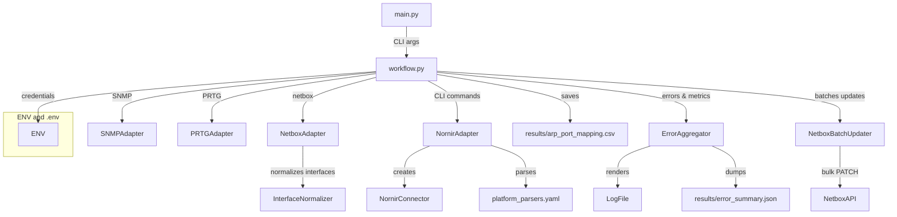

# ARP Port Mapper

## Overview

ARP Port Mapper is a Python-based tool designed to automate the mapping of ARP entries from gateways to switch ports in a network infrastructure. It leverages NetBox for inventory management, SNMP for ARP table retrieval, Nornir for CLI-based MAC table collection, and optionally PRTG for SNMP settings. The tool is intended for mid-level sysadmins managing large-scale networks, enabling quick IP/MAC-to-port correlations, NetBox updates, and error analysis without manual intervention.

Key purposes:
- Aggregate ARP data from multiple gateways per site.
- Correlate with switch MAC tables.
- Update NetBox interface descriptions (configurable).
- Generate CSV reports and error summaries for auditing.

This tool supports dynamic inventories, secure credential management via environment variables, and extensible platform parsing via YAML.

## Features

- **Multi-Gateway Support:** Handles multiple gateways per site, merging ARP tables without data loss on failures.
- **Dynamic Inventory:** Pulls devices from NetBox based on roles and sites.
- **SNMP and CLI Integration:** Retrieves ARP via SNMP (with PRTG fallback) and MAC tables via Nornir/Netmiko.
- **Interface Normalization:** Maps short/long interface names (e.g., `Po1` → `Port-channel1`) for accurate NetBox updates.
- **Batch Updates:** Efficient bulk PATCH to NetBox for interface descriptions, with filtering for access ports.
- **Error Aggregation:** Summarizes errors and metrics in JSON and logs for post-run analysis.
- **CLI Interface:** Flexible execution with options for sites, output paths, verbosity, and more.
- **Extensibility:** Add new switch platforms via `platform_parsers.yaml` without code changes.

Trade-offs:
- Relies on NetBox as the source of truth; incomplete inventories lead to skipped devices.
- SNMP/CLI access requires proper credentials and may timeout on slow devices (configurable via YAML).

## Requirements

- **Python:** 3.8+ (tested on 3.12)
- **Dependencies:** Listed in `setup.py`. Install via `pip install -e .` or `pip install .` for the `custom_modules` package.
- **External Services:**
  - NetBox (v3.5+ recommended) with API token.
  - PRTG (optional) for SNMP settings.
- **Network Access:** SNMP read access to gateways; SSH/CLI access to switches.
- **Environment Variables:** For credentials (e.g., `DEVICE_USERNAME_ADMIN`, `NETBOX_TOKEN`).

Hardware/Performance Notes:
- Suitable for environments with hundreds of devices; scales with Nornir workers (configurable in `nornir_config.yaml`).
- Memory usage: ~100-500 MB for large sites (thousands of ARP/MAC entries).

## Installation

1. Clone the repository:
   ```bash
   git clone https://github.com/CherMet90/arp_port_mapper.git
   cd arp-port-mapper
   ```

2. Install dependencies:
   ```bash
   pip install -r requirements.txt
   ```

3. Set up environment variables (use `.env` file or export):
   ```bash
   # Example .env
   NETBOX_URL=https://netbox.example.com
   NETBOX_TOKEN=your-netbox-api-token
   DEVICE_USERNAME_ADMIN=admin_user
   DEVICE_PASSWORD_ADMIN=admin_pass
   # Add more for tags (e.g., DEVICE_USERNAME_READONLY)
   ```

4. Load environment:
   ```bash
   export $(cat .env | xargs)  # Or use python-dotenv in scripts
   ```

## Configuration

Configurations are in `config.py` and YAML files. Edit them before running.

- **config.py:**
  - `APP_DEFAULTS`: Log level, verbose mode, update_netbox flag, overwrite_existing_descriptions, etc.
  - `GATEWAY_SNMP_CONFIG`: Default SNMP community and version.
  - `PORT_FILTER`: Enabled by default; filters ports with >2 unique (MAC, VLAN) pairs for NetBox updates.
  - `TAG_CREDENTIALS`: Maps NetBox tags to env var suffixes for credentials.

- **platform_parsers.yaml:** Commands and parsers for switch platforms (e.g., Cisco, Zyxel). Example:
  ```yaml
  platform_parsers:
    cisco_ios:
      netmiko_platform: "cisco_ios"
      mac_table_command: "show mac address-table"
      parser: "genie"
      connection_options:
        netmiko:
          extras:
            read_timeout_override: 30
  ```

- **gw_list.csv:** Gateways config (site;gw;prefix;community). Example:
  ```
  site;gw;prefix;community
  moscow;192.168.1.1;192.168.1.0/24,192.168.2.0/24;public
  spb;10.0.0.1;10.0.0.0/24;public
  ```

- **nornir_config.yaml:** Nornir settings (workers, logging).

After changes, restart the script to apply.

## Usage

Run via `main.py` with Click-based CLI. Required: prefix_roles (e.g., "servers", "workstations").

### Basic Command
```bash
python main.py servers workstations
```
- Processes all sites.
- Outputs to `results/arp_port_mapping.csv` (full) and `results/arp_port_mapping_filtered.csv` (filtered for NetBox updates).

### Options
- `--output / -o <file>`: Custom output CSV path (default: `results/arp_port_mapping.csv`).
- `--sites / -s <slug> [--sites <slug2>]`: Process specific sites (multiple allowed; none = all).
- `--verbose / -v`: Enable detailed console output.
- `--enable-session-log`: Log Netmiko sessions to `session_logs/` for debugging.

Examples:
```bash
# Specific sites, custom output
python main.py servers --sites moscow --sites spb --output moscow_spb.csv --verbose

# All sites with session logging
python main.py servers workstations --enable-session-log
```

### Output Files
- **CSV Reports:** Mappings with columns: site, ip_address, mac_address, switch, interface, vlan, mac_type.
- **error_summary.json:** Metrics (e.g., gateways_ok/fail, switches_ok/fail, mappings_total, netbox_updates_ok/fail) and error details.
- **Logs:** In `logs/arp_mapper.log` (configurable).

To enable interfaces descriptions updates: Set `update_netbox = True` in `config.py`.

## Architecture

The tool follows a modular adapter-based design for extensibility.



- **Data Flow:** Prefixes from NetBox → Gateways from CSV → ARP via SNMP → MAC via Nornir → Correlation → Filtered Updates to NetBox.
- **Key Components:**
  - `workflow.py`: Orchestrates the process.
  - `adapters/`: Interfaces to external systems.
  - `custom_modules/`: Reusable utilities (e.g., batch updater, normalizer).

## Extensibility

- **New Platforms:** Add entries to `platform_parsers.yaml` with `netmiko_platform`, commands, and parsers.
- **Custom Filters:** Extend `_filter_ports_for_netbox_update()` in `workflow.py` for additional criteria (e.g., LLDP via Nornir tasks).
- **Credentials:** Add NetBox tags and env vars in `config.TAG_CREDENTIALS`.
- **PRTG Integration:** Enable/disable via `config.PRTG_CONFIG['use_prtg']`.

Example: Adding a new platform (e.g., Juniper):
```yaml
juniper_junos:
  netmiko_platform: "juniper_junos"
  mac_table_command: "show ethernet-switching table"
  parser: "textfsm"
  connection_options:
    netmiko:
      extras:
        fast_cli: False
```

## Troubleshooting

- **Common Errors:**
  - `'Endpoint' object has no attribute 'partial_update'`: Ensure pynetbox ≥7.2.0; check bulk update implementation.
  - 403 Forbidden: Verify API token has write permissions for `dcim | interface`.
  - High `not_found` in stats: Review interface names in NetBox vs. switch outputs; extend `INTERFACE_MAPPINGS` in `interface_normalizer.py`.
  - Timeouts: Increase `read_timeout_override` in `platform_parsers.yaml` for slow platforms.

- **Debugging:**
  - Run with `--verbose` and `--enable-session-log` to inspect connections.
  - Check `results/error_summary.json` for metrics (e.g., `ports_excluded_from_updates`).
  - Test SNMP: `snmpwalk -v2c -c public <gw_ip> 1.3.6.1.2.1.3.1.1`.

- **Performance Tips:**
  - Reduce `batch_size` in `NetboxBatchUpdater` if hitting request size limits.
  - Increase Nornir workers in `nornir_config.yaml` for parallel MAC table collection.

If issues persist, check logs and open an issue with details (e.g., error stack, config snippets).